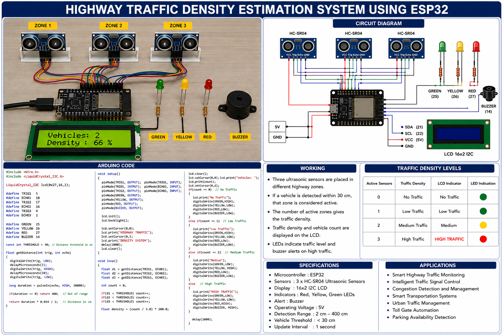

# 🚗 Highway Traffic Density Estimation System using ESP32

## 📌 Overview

**Highway Traffic Density Estimation System Using Ultrasonic Sensors** is an embedded system designed for **real-time highway traffic monitoring and congestion estimation** using an **ESP32 microcontroller**. The system continuously detects vehicle presence across multiple highway zones using **HC-SR04 ultrasonic sensors**, estimates traffic density, displays live vehicle count and traffic status on a **16×2 I2C LCD**, and automatically controls **traffic signal LEDs and buzzer alerts** based on predefined traffic thresholds.

This project demonstrates **embedded firmware development, ultrasonic sensor interfacing, real-time traffic density estimation, automation, and intelligent traffic management**, making it suitable for **smart highways, traffic monitoring systems, congestion detection, and intelligent transportation applications**.

<p align="center">
  
</p>

---

## ⚙️ Key Features

- 🚗 Real-time traffic density estimation
- 📡 Multi-zone vehicle detection using ultrasonic sensors
- 📟 16×2 I2C LCD display
- 🚦 Automatic traffic signal indication
- 🔔 Buzzer alert during heavy traffic conditions
- 📊 Continuous traffic monitoring
- 🧩 Modular embedded firmware architecture
- ⚡ ESP32-based intelligent traffic monitoring system

---


### Hardware Components

- **ESP32-WROOM-32**
- **HC-SR04 Ultrasonic Sensor (Zone 1)**
- **HC-SR04 Ultrasonic Sensor (Zone 2)**
- **HC-SR04 Ultrasonic Sensor (Zone 3)**
- **16×2 LCD (I2C)**
- **Green LED**
- **Yellow LED**
- **Red LED**
- **Buzzer**

---

## 🚀 How It Works

1. ESP32 initializes all peripherals and sensors.
2. Three ultrasonic sensors continuously measure vehicle distance.
3. Vehicle presence is detected using predefined distance thresholds.
4. The system counts the number of occupied highway zones.
5. Traffic density is estimated based on the number of active sensors.
6. Vehicle count and traffic status are displayed on the LCD.
7. Traffic LEDs indicate **Low, Medium, or High Traffic**.
8. The buzzer activates during high traffic conditions.
9. The monitoring cycle repeats continuously.

---

## 🔌 Hardware Connections

| Component | ESP32 Pin |
|-----------|-----------|
| Ultrasonic Sensor 1 TRIG | GPIO 5 |
| Ultrasonic Sensor 1 ECHO | GPIO 18 |
| Ultrasonic Sensor 2 TRIG | GPIO 17 |
| Ultrasonic Sensor 2 ECHO | GPIO 16 |
| Ultrasonic Sensor 3 TRIG | GPIO 4 |
| Ultrasonic Sensor 3 ECHO | GPIO 2 |
| Green LED | GPIO 25 |
| Yellow LED | GPIO 26 |
| Red LED | GPIO 27 |
| Buzzer | GPIO 14 |
| LCD SDA | GPIO 21 |
| LCD SCL | GPIO 22 |

---

## 💻 Firmware Implementation

### Distance Measurement

```cpp
float getDistance(int trig, int echo)
{
    digitalWrite(trig, LOW);
    delayMicroseconds(2);

    digitalWrite(trig, HIGH);
    delayMicroseconds(10);

    digitalWrite(trig, LOW);

    long duration = pulseIn(echo, HIGH);

    return duration * 0.034 / 2;
}
```

### Vehicle Detection

```cpp
int count = 0;

if(distance1 < 30) count++;
if(distance2 < 30) count++;
if(distance3 < 30) count++;
```

### LCD Display

```cpp
lcd.clear();

lcd.setCursor(0,0);
lcd.print("Vehicles:");
lcd.print(count);

lcd.setCursor(0,1);

if(count == 0)
    lcd.print("No Traffic");
else if(count == 1)
    lcd.print("Low Traffic");
else if(count == 2)
    lcd.print("Medium");
else
    lcd.print("HIGH TRAFFIC");
```

### Traffic Control Logic

```cpp
if(count == 0)
{
    digitalWrite(GREEN, HIGH);
}
else if(count == 1)
{
    digitalWrite(GREEN, HIGH);
}
else if(count == 2)
{
    digitalWrite(YELLOW, HIGH);
}
else
{
    digitalWrite(RED, HIGH);
    digitalWrite(BUZZER, HIGH);
}
```

---

## 🛠️ Software Requirements

- Arduino IDE / PlatformIO
- ESP32 Board Package
- LiquidCrystal_I2C Library

---

## 📊 Traffic Density Levels

The system estimates traffic density based on the number of active ultrasonic sensors.

| Active Sensors | Traffic Density |
|----------------|-----------------|
| 0 | No Traffic |
| 1 | Low Traffic |
| 2 | Medium Traffic |
| 3 | High Traffic |

The LCD displays:

- **No Traffic**
- **Low Traffic**
- **Medium**
- **HIGH TRAFFIC**

---

### Open in Arduino IDE

1. Install the **ESP32 Board Package**.
2. Install the **LiquidCrystal_I2C** library.
3. Connect the hardware components.
4. Select the ESP32 board.
5. Upload the firmware to the ESP32.

---

## ⚠️ Limitations

- Detection accuracy depends on ultrasonic sensor placement.
- Environmental conditions may affect sensor performance.
- The system estimates traffic density rather than exact vehicle count.
- Suitable for short-range traffic monitoring applications.

---

## 🚀 Future Enhancements

- AI-based traffic prediction
- Adaptive traffic signal timing
- Camera-based vehicle detection
- Emergency vehicle priority system
- Vehicle speed estimation
- Multi-lane traffic monitoring
- Cloud-based traffic analytics
- Mobile application for remote monitoring

---

## 🧠 Skills Demonstrated

- ESP32 Programming
- Embedded C / Arduino IDE
- Ultrasonic Sensor Interfacing
- LCD Interfacing
- GPIO Programming
- Real-Time Traffic Monitoring
- Traffic Density Estimation
- Intelligent Traffic Control
- Sensor-Based Automation
- Embedded Systems Design

---


